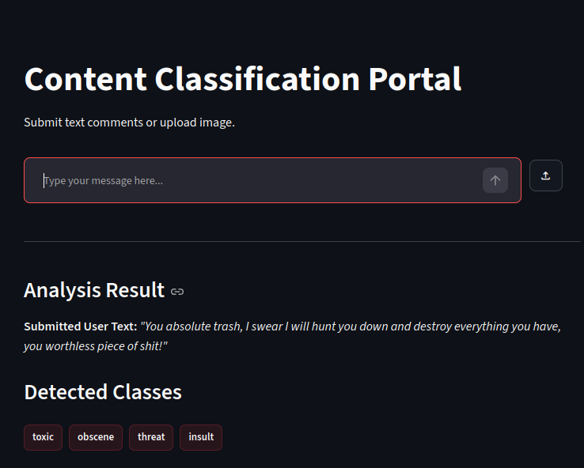
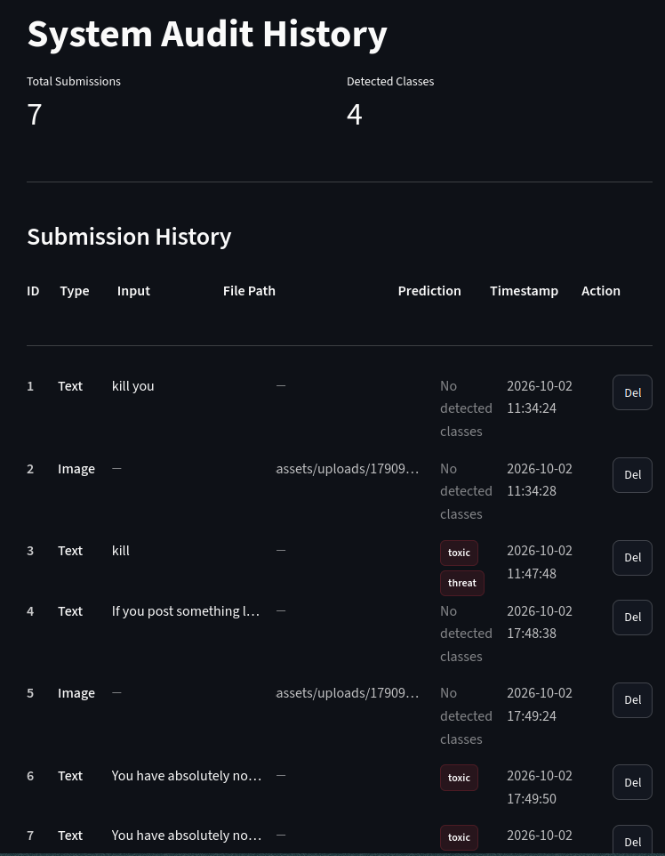

# Content Classification Portal

A high-performance, modular Streamlit web application designed to evaluate and classify textual comments and visual media for multi-label toxicity detection. The system seamlessly bridges computer vision (BLIP image captioning) with deep learning natural language processing (PyTorch LSTM).

---

## Interface Preview

### Evaluation Workspace

The primary workspace allows users to input text comments or upload images for instant multi-label toxicity analysis.



### System Audit History

The audit view provides comprehensive tracking, performance metrics, and record management for all past submissions.


---

## Project Structure

The project is organized into a clean, maintainable modular architecture:

```text
root/
├── assets/
│   ├── uploads/
│   ├── classification_portal.png
│   ├── history_picture.png
│   ├── config.json
│   ├── lstm_weights.pt
│   └── vocab.json
├── notebooks/
│   ├── lstm-toxic-comments-classify.ipynb
│   └── rnn-toxic-comments-classify.ipynb
├── src/
│   ├── __init__.py
│   ├── csv_manager.py
│   ├── image_caption.py
│   ├── model.py
│   ├── predict.py
│   ├── text_classification.py
│   └── text_preprocessing.py
├── app.py
├── history.csv
├── LICENSE
├── README.md
└── requirements.txt
```

## Key Features

- **Dual-Mode Processing**: Evaluate direct text comments or upload images (`.jpg`, `.png`, `.jpeg`) that are automatically captioned before classification.

- **Multi-Label Toxicity Detection**: Identifies categories including toxic, severe_toxic, obscene, threat, insult, and identity_hate.

- **Persistent Audit Logs**: Automatically records submissions, predictions, and timestamps with full management controls to delete past entries.

- **Optimized Local Inference**: Implements efficient tensor caching and `torch.inference_mode()` for fast, responsive execution on CPU.

---

## Setup and Installation

1. **Clone the repository**:

   ```bash
   git clone https://github.com/AbdelrahmanGaber528/Cellula_2Week_Abdelrahman_Gaber.git
   cd Cellula_2Week_Abdelrahman_Gaber
   ```

2. **Install dependencies**:

   Ensure you have Python installed, then install the required packages listed in `requirements.txt`:

   ```bash
   pip install -r requirements.txt
   ```

3. **Verify Model Assets**:

   Ensure your `assets/` folder contains your trained weights (`lstm_weights.pt`), configuration (`config.json`), and vocabulary (`vocab.json`).

---

## How to Run and Use the App

### Running the Application

Launch the Streamlit web server from your project root directory:

```bash
streamlit run app.py
```

This command will automatically open the interactive web portal in your default browser.

### Using the Portal

1. **Navigation**: Use the sidebar radio buttons to switch between the **Evaluation Workspace** and **History Logs**.

2. **Evaluation Workspace**:

   - Type a comment into the chat input bar or upload an image using the file uploader.
   - View the real-time classification results and generated caption badges instantly.

3. **History Logs**:

   - Navigate to the audit view to review total submission metrics and detailed past evaluations.
   - Use the **Delete** button next to any record to remove it from the persistent log.

---

## License

This project is open-source and available under the terms specified in the `LICENSE` file.